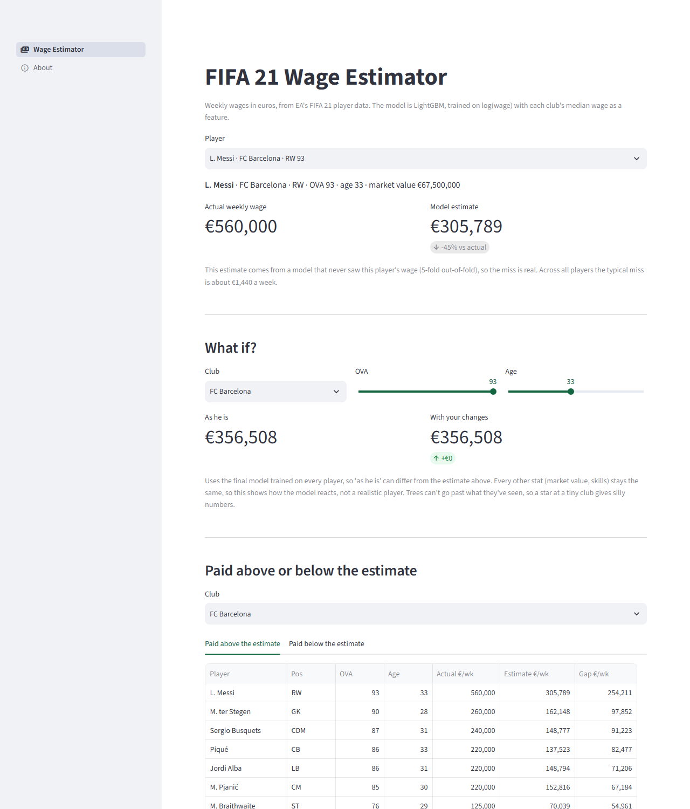

# FIFA 21 Wage Estimator

**Live app: [fifa-wage-prediction.streamlit.app](https://fifa-wage-prediction.streamlit.app/)**

A small web app that estimates a football player's weekly wage from their FIFA 21 stats, built with Streamlit and LightGBM.



The model was built in a separate notebook project: [fifa-player-wage-prediction](https://github.com/GilbertOwen/fifa-player-wage-prediction). This repo turns that model into something you can click around in.

## What it does

**Wage Estimator page**
- **Player lookup:** pick any of 18,741 players and compare their real weekly wage with the model's estimate.
- **What if?:** move a player to another club, or change their OVA or age, and see how the estimate reacts.
- **Paid above or below the estimate:** for any club, the players whose wages the model explains worst.

**About page:** how the model got from €7,754 to €1,485 average miss, what I got wrong along the way, and its limitations.

## How it works

```
data/fifa21_cleaned.csv
        │
   prepare.py        the notebook's preparation steps as functions
        │
   train.py          run once
        ├── artifacts/model.joblib           final model + column list + club medians
        └── artifacts/oof_predictions.csv    an honest estimate for every player
        │
   app.py            Streamlit, loads the artifacts and predicts
```

Two decisions worth knowing:

- **The player lookup shows honest estimates.** Each player is predicted by a model that never saw their wage (5-fold out-of-fold). If I used the final model, which trained on everyone, the lookup would look much better than it really is.
- **Training and the app share one recipe.** Both use `prepare.py`, so the app prepares a player exactly the way training did. `check.py` proves it matches the notebook: the same test MAE (1484.76), and a player prepared alone matches the same player in the full table for all 15 positions.

## Run it locally

```bash
python -m venv venv
venv\Scripts\activate
pip install -r requirements.txt
streamlit run app.py
```

The artifacts are already in the repo. To rebuild them from the data:

```bash
python train.py
python check.py
```

## Project structure

```
app.py               entry point, page navigation
shared.py            cached loading and predict_wage()
views/main.py        Wage Estimator page
views/about.py       About page
prepare.py           data preparation, shared by training and the app
train.py             trains and saves the artifacts
check.py             checks prepare.py against the notebook
data/                cleaned FIFA 21 data
artifacts/           saved model and out-of-fold estimates
```

## Limitations

- It's game data. It learns how EA sets wages in FIFA 21, not real contracts.
- Stars are guessed too low. Tree models can't predict past the highest wages they've seen.
- It only works for players in the dataset, because it needs every FIFA stat as input.
- The what-if changes one thing while everything else stays the same, so it shows how the model reacts, not a realistic player.
